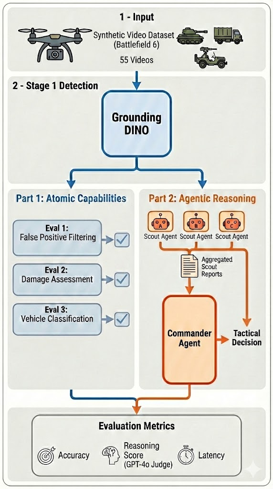
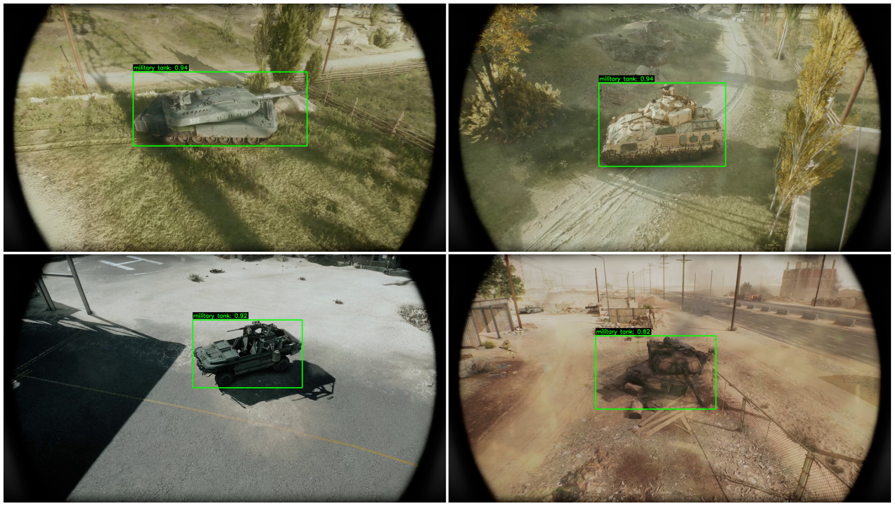

<p align="center">
  
</p>

<h1 align="center">Synthesizing the Kill Chain:<br/>A Zero-Shot Framework for Target Verification<br/>and Tactical Reasoning on the Edge</h1>

<p align="center">
  <strong>Jesse Barkley</strong>, <strong>Abraham George</strong>, and <strong>Amir Barati Farimani</strong><br/>
  Department of Mechanical Engineering, Carnegie Mellon University
</p>

<p align="center">
  <a href="#overview">Overview</a> &bull;
  <a href="#key-results">Key Results</a> &bull;
  <a href="#getting-started">Getting Started</a> &bull;
  <a href="#pipeline">Pipeline</a> &bull;
  <a href="#evaluations">Evaluations</a> &bull;
  <a href="#agentic-workflow">Agentic Workflow</a> &bull;
  <a href="#dataset">Dataset</a> &bull;
  <a href="#citation">Citation</a>
</p>

---

## Overview

Deploying autonomous edge robotics in dynamic military environments presents a dual challenge: **scarce domain-specific training data** limits supervised models, while **computational constraints** of edge hardware prevent deployment of large foundation models. This repository contains all code and data for our research on a **hierarchical, zero-shot framework** that bridges this gap by cascading lightweight object detection with compact Vision-Language Models (VLMs).

Our framework operates in two stages:

1. **Semantic Trigger** &mdash; [Grounding DINO](https://github.com/IDEA-Research/GroundingDINO) acts as a high-recall, text-promptable region proposer to identify potential targets *without fine-tuning*.
2. **VLM Verification** &mdash; Edge-class VLMs (4B&ndash;12B parameters) from the **Qwen** and **Gemma** families serve as secondary semantic verifiers, performing false-positive filtering, damage assessment, fine-grained classification, and multi-step tactical reasoning.

We evaluate this pipeline on **55 high-fidelity synthetic videos** from *Battlefield 6* across perception tasks and an agentic decision-making workflow, running entirely on consumer-grade hardware (NVIDIA RTX 4060 Laptop, 8GB VRAM).

<p align="center">
  
</p>
<p align="center"><em>Example detections from Grounding DINO across dataset categories. High-confidence frames are extracted and passed to VLMs for semantic verification.</em></p>

---

## Key Results

### Atomic Perception Evaluations

| Model | Params | Eval 1: FP Filter | Eval 2: Damage | Eval 3: IFV/MBT | Latency/Image |
|:------|:------:|:-----------------:|:--------------:|:----------------:|:-------------:|
| Qwen3-VL-4B | 4B | **100%** | **97.5%** | 85% | 5.7s |
| Qwen3-VL-8B | 8B | **100%** | 95% | **90%** | 10.8s |
| Gemma3-4B | 4B | 80% | 47.5% | 55% | 2.0s |
| Gemma3-12B | 12B | 93.3% | 70% | 70% | 4.8s |

### Agentic Workflow (Scout &rarr; Commander)

| Model | E2E Accuracy | E2E Reasoning | Controlled Accuracy | Controlled Reasoning | Failure Mode |
|:------|:------------:|:-------------:|:-------------------:|:--------------------:|:------------|
| Qwen3-VL-4B | **100%** | 9.8/10 | **100%** | 10.0/10 | None |
| Qwen3-VL-8B | **100%** | 9.8/10 | **100%** | 10.0/10 | None |
| Gemma3-4B | 40% | 3.2/10 | 0% | 2.0/10 | Semantic Non-Compliance |
| Gemma3-12B | 20% | 3.4/10 | **100%** | 9.8/10 | Perceptual Blindness |

> **Key Finding:** The *Controlled Input* experiment decouples perception from reasoning. Gemma3-12B is a **"Blind Strategist"** &mdash; perfect tactical logic when given accurate text, but fails visually. Gemma3-4B exhibits **reasoning collapse**, making illogical decisions even with perfect situational awareness.

---

## Getting Started

### Prerequisites

- Python 3.10+
- NVIDIA GPU with CUDA support (tested on RTX 4060 Laptop, 8GB VRAM)
- [Ollama](https://ollama.com/) installed and running
- An [OpenAI API key](https://platform.openai.com/api-keys) (for GPT-4o grading in agentic evaluations)

### Installation

```bash
# Clone the repository
git clone https://github.com/jabarkle/Synthesizing-the-Kill-Chain-Zero-Shot-Computer-Vision-and-VLM-Research.git
cd Synthesizing-the-Kill-Chain-Zero-Shot-Computer-Vision-and-VLM-Research

# Install Python dependencies
pip install torch torchvision transformers opencv-python Pillow ollama openai matplotlib

# Pull the required VLM models via Ollama
ollama pull qwen3-vl:4b
ollama pull qwen3-vl:8b
ollama pull gemma3:4b
ollama pull gemma3:12b
```

### Configuration

For the agentic evaluations (GPT-4o grading), add your OpenAI API key in:
- `AgentEval.py` &rarr; `OPENAI_API_KEY`
- `AgentEvalControlled.py` &rarr; `OPENAI_API_KEY`

---

## Pipeline

The framework follows a hierarchical **Filter-then-Verify** architecture:

```
                    ┌──────────────────────────────┐
                    │     Input Video (10s clip)    │
                    └──────────────┬───────────────┘
                                   ▼
                    ┌──────────────────────────────┐
                    │  Stage 1: Grounding DINO      │
                    │  Text prompt: "military tank"  │
                    │  Extracts highest-confidence   │
                    │  frame per video               │
                    └──────────────┬───────────────┘
                                   ▼
                    ┌──────────────────────────────┐
                    │  Stage 2: VLM Verification    │
                    │  Qwen3-VL / Gemma3            │
                    │  • False positive filtering   │
                    │  • Damage assessment          │
                    │  • Vehicle classification     │
                    │  • Agentic tactical reasoning  │
                    └──────────────────────────────┘
```

### Running the Full Pipeline

```bash
# Stage 1: Extract highest-confidence frames from all videos
python GDDetections.py

# Stage 2: Run all atomic VLM evaluations + statistics
python RunAllEvaluations.py

# Agentic evaluations (E2E + Controlled Input)
python RunAgentEvaluations.py
```

---

## Evaluations

### Eval 1 &mdash; False Positive Filtering

Tests whether VLMs can correctly reject Grounding DINO detections on non-tank vehicles (trucks, construction equipment).

```bash
python Eval1.py && python Eval1Statistics.py
```

- **Dataset:** 15 images from `output/Car Truck Construction/`
- **Expected answer:** `DENY` (these are not military tanks)
- **Best performer:** Qwen3-VL-4B and Qwen3-VL-8B (both 100%)

### Eval 2 &mdash; Damage Assessment

Tests whether VLMs can distinguish between operational and destroyed military vehicles.

```bash
python Eval2.py && python Eval2Statistics.py
```

- **Dataset:** 40 images (20 destroyed + 20 operational)
- **Expected answers:** `OPERATIONAL` or `DESTROYED`
- **Best performer:** Qwen3-VL-4B (97.5%)

### Eval 3 &mdash; Vehicle Type Classification

Tests fine-grained classification between Infantry Fighting Vehicles (IFV) and Main Battle Tanks (MBT).

```bash
python Eval3.py && python Eval3Statistics.py
```

- **Dataset:** 20 images (10 IFV + 10 MBT)
- **Expected answers:** `IFV` or `MBT`
- **Best performer:** Qwen3-VL-8B (90%)

---

## Agentic Workflow

The agentic evaluation tests whether single-task VLM capabilities compose into multi-step tactical reasoning through a simulated **Scout&ndash;Commander** pipeline.

### Scenario Design

Each of 5 scenarios presents a tri-lemma of three objectives:

| Objective | Target | VLM Reasoning Goal |
|:---------:|:-------|:-------------------|
| A | Operational MBT | **ENGAGE** (highest priority) |
| B | Trucks / Logistics | CONSIDER (low priority) |
| C | Destroyed Tank | IGNORE (no threat) |

### Two-Agent Architecture

```
┌─────────────────────────────────────────────────────────────┐
│  AGENT 1 — Scout Drone                                      │
│  Analyzes each objective image independently                │
│  Outputs: Vehicle Type, Operational Status, Description     │
└──────────────────────────┬──────────────────────────────────┘
                           ▼
                 Aggregated Scout Reports
                           ▼
┌─────────────────────────────────────────────────────────────┐
│  AGENT 2 — Command & Control                                │
│  Receives text-only reports (no images)                     │
│  Selects target for kamikaze anti-tank drone deployment     │
│  Outputs: Target selection + tactical reasoning             │
└──────────────────────────┬──────────────────────────────────┘
                           ▼
┌─────────────────────────────────────────────────────────────┐
│  GPT-4o Judge                                               │
│  Evaluates reasoning quality (1–10 scale)                   │
└─────────────────────────────────────────────────────────────┘
```

### End-to-End vs. Controlled Input

- **End-to-End (E2E):** Same model performs both scouting and command.
- **Controlled Input:** Qwen3-VL-8B generates all scout reports; each model only makes the tactical decision. This **decouples perception from reasoning** to diagnose failure modes.

```bash
# Run both pipelines
python RunAgentEvaluations.py

# Or individually
python AgentEval.py            # E2E
python AgentEvalControlled.py  # Controlled Input
```

---

## Dataset

We constructed a custom synthetic dataset of **55 ten-second video clips** recorded from a first-person drone perspective in *Battlefield 6* (Frostbite Engine) during active multiplayer gameplay.

| Category | Videos | Description |
|:---------|:------:|:------------|
| Car Truck Construction | 15 | Military logistics trucks, armed utility vehicles, construction excavators |
| Destroyed Tanks | 20 | MBTs/IFVs with catastrophic damage, fire, missing turrets |
| Operational IFVs | 10 | Infantry Fighting Vehicles in active combat states |
| Operational MBTs | 10 | Fully functional heavy armor (e.g., M1 Abrams) |
| **Total** | **55** | |

The video dataset is included in `DataForResearch/`. Pre-extracted detection frames are available in `output/` (raw) and `output_annotated/` (with bounding boxes).

---

## Project Structure

```
├── DataForResearch/                # Synthetic video dataset (55 MP4 clips)
│   ├── Car Truck Construction/     # False positive test videos
│   ├── DestroyedTanks/             # Destroyed vehicle videos
│   ├── IFV/                        # Infantry Fighting Vehicle videos
│   └── MBT/                        # Main Battle Tank videos
│
├── output/                         # Grounding DINO extracted frames (raw)
├── output_annotated/               # Extracted frames with bounding boxes
│
├── AgentTest/                      # Agentic scenario images
│   └── AgentImageInput/
│       ├── Scenario1/ ... Scenario5/
│
├── Results/                        # All evaluation outputs
│   ├── Eval{1,2,3}_results.json    # Raw evaluation results
│   ├── Eval{1,2,3}_table.png       # Publication-ready tables
│   ├── Eval{1,2,3}_results.csv     # CSV exports
│   ├── AgentEval_E2E_*             # End-to-end agentic results
│   └── AgentEval_Controlled_*      # Controlled input results
│
├── GDDetections.py                 # Grounding DINO frame extraction
├── GDDetectionsAnnotated.py        # Frame extraction with bounding boxes
├── Eval1.py                        # False positive filtering evaluation
├── Eval2.py                        # Damage assessment evaluation
├── Eval3.py                        # Vehicle type classification
├── Eval{1,2,3}Statistics.py        # Statistics & table generation
├── AgentEval.py                    # End-to-end agentic evaluation
├── AgentEvalControlled.py          # Controlled input agentic evaluation
├── AgentEvalStatistics.py          # E2E agentic statistics
├── AgentEvalControlledStatistics.py # Controlled agentic statistics
├── GenerateScoutReports.py         # Scout report markdown generator
├── RunAllEvaluations.py            # Run full atomic evaluation pipeline
├── RunAgentEvaluations.py          # Run both agentic pipelines
├── ClearAllOutputs.py              # Reset all outputs for fresh run
├── ClearAgentOutputs.py            # Reset agentic outputs only
└── Warmup.png                      # GPU warmup image
```

---

## Models Evaluated

All models were served via [Ollama](https://ollama.com/) using **4-bit quantization (Q4_K_M)** to simulate real edge deployment constraints.

| Model | Parameters | Family | Quantization |
|:------|:---------:|:------:|:------------:|
| Qwen3-VL-4B | 4B | Alibaba Qwen | Q4_K_M |
| Qwen3-VL-8B | 8B | Alibaba Qwen | Q4_K_M |
| Gemma3-4B | 4B | Google Gemma | Q4_K_M |
| Gemma3-12B | 12B | Google Gemma | Q4_K_M |

---

## Hardware

All experiments were conducted on a consumer laptop as a proxy for high-end edge compute (e.g., NVIDIA Jetson AGX Orin):

- **GPU:** NVIDIA RTX 4060 Laptop (8GB VRAM)
- **Evaluation Judge:** GPT-4o (for tactical reasoning scoring)

---

## Citation

If you use this code, framework, or dataset in your research, please cite:

```bibtex
@inproceedings{barkley2026killchain,
  title={Synthesizing the Kill Chain: A Zero-Shot Framework for Target Verification and Tactical Reasoning on the Edge},
  author={Barkley, Jesse and George, Abraham and Farimani, Amir Barati},
  year={2026},
  institution={Carnegie Mellon University}
}
```

---

## License

This project is for academic research purposes. Please use responsibly.
